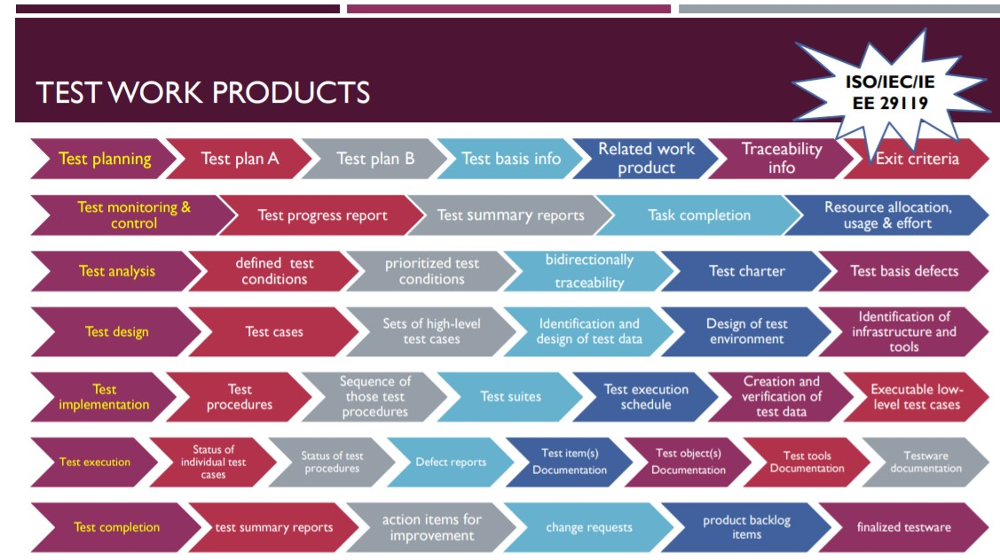

# Chapter 1: Fundamentals of Testing

Actual Notes: [Chapter 1](file:///C:/Users/User/Desktop/DegStud/Sem%207%202021/CSEB424%20Software%20Testing/chapter_1.pdf)

Terminology: [Glossary](https://glossary.istqb.org/en/search/)

-----
## What is Testing?
-----
### Definition of Testing (ISQTB Foundation V3.1 -2018)

> The process consisting of `all lifestyle activities`, both `static and dynamic`, concerned with `planning, preparation and evaluation` of a `component or system and related work products` to determine that they `satisfy specified requirements`, to demonstrate that they are `fit for purpose(usable)` and `to detect defects`.

-----
### Objectives of Testing

- To prevent defects by evaluate work products such as `requirements`, `user stories`, `design` and `code`
- To verify whether all specified requirements have been fulfilled
- To check whether the `test object` (component or system and related work products) is complete and validate if it works as the users and other stakeholders expect
- To build confidence in the level of quality of the test object
- To find defects and failures thus reduce the level of risk of inadequate software quality
- To provide sufficient information to stakeholders to allow them to make informed decisions, especially regarding the level of quality of the test object
- To comply with contractual, legal, or regulatory requirements or standards, and/or to verify the test object's compliance with such requirements or standards

_Depends upon the context of the component or system being tested, the test level, and the software development lifecycle model._

- Plan
  - No testing in planning phase
- Analysis
  - Testing conducted in analysis phase
  - Objective > Verify the contents in SRS
- Design
  - Testing conducted in design phase
  - Objective > Verify the contents in SDS
- Implementation
  - Testing conducted in implementation phase
  - Objective > Verify whether the system satisfy specified requirements

-----
### Testing and Debugging

| Testing | Debugging |
| ------- | --------- |
| Show failures that are caused by defects in the software | Part of development activity that finds, analyzes, and fixes defects |
| Done by tester | Done by developer |

-----
## Why is Testing Necessary

-----
### Testing's Contributions to Success

- Testers involved in requirements reviers or user story refinement to identify requirements defects
  > Reduce the risk of incorrect or untestable features being developed
- Testers work closely with system designers to increase understanding of the design and how to test it
  > Reduce the risk of fundamental design defects enable tests to be identified at an early stage
- Testers work closely with developers to understand the code and how to test it
  > Reduce the risk of defects within the code and tests
- Testers verify and validate the software prior to release
  > Increase the likelihood that the software meets stakeholder needs and satisfies requirements

-----
### Quality Assurance and Testing
-----
**Quality Assurance != Testing**

Quality Management
- Quality Assurance 
  - Proper execution of the entire process
  - Ensure that appropriate levels of quality will be achieved
- Quality Control
  - Proper testing
  - Ensure the achievement of appropriate levels of quality

-----
### Errors, Defects, and Failure
-----

| Term | Definition |
|-----|-----|
| Error | `Human` action that produces an incorrect result |
| Fault/Defect/Bugs | A flaw in a component or system that can cause the component or system to fail to prerform its required function |
| Failure | Deviation of the component or system from its expected delivery, service or result |

-----
### Why Errors Occurs
-----

- Time pressure
- Human fallability
- Inexperienced or insufficiently skilled project participants
- Miscommunication between project participants, including miscommunication about requirements and design
- Complexity of the code, design, architecture, the underlying problem to be solved, and/or technologies used
- Misunderstandings about intra-system and inter-system interfaces, especially when such intra-system and inter-system interactions are large in number
- New, unfamiliar technologies

-----
### Disney's Lion King, 1994-1995
-----

|Reasons|Description|
|-----|-----|
|Failure|The game failed to run/execute on different PC models.|
|Defect|The system specfication is limited.|
|Error|The developers does not tested the system with other PC models and publish it without stating it.|
|Root cause|Disney's developers did not test the game with users' PC Model|
|Improvement in future|The Disney's developers should test both functional requirements and non-functional requirements.|

-----
### NASA Mars Polar Lander, 1999
-----

|Reasons|Description|
|-----|-----|
|Failure|NASA’s Mars Polar Lander destroyed.|
|Defect|The mechanical vibrators activated earlier.|
|Error|They did not test both of the components together.|

-----
### Defects, Root Causes and Effects
-----

- Root Cause Analysis
  > - Actions or conditions that contributes to the creationg of defects
  > - Lead to process improvements that prevent a significant number of future defects from being introduced
- Analyzing of Defects
  > - To identify their root causes
  > - To reduce the occurence of similar defects in the future

-----
## Seven Testing Principles (*10 Sept. 2020, end of class*)
-----

- Testing shows Presence of Defects
  > Testing shows presence of defects, cannot prove absence of defects. Testing helps in finding undiscovered defects.

- Early Testing
  > Start testing as soon as possible. Finding defects early on saves a lot of money rather than finding them later.

- Testing - Context Dependent
  > Testing is context dependent. Different websites are tested differently. E.g., Banking site tested differently than Shopping site.

- Exhaustive Testing is Impossible
  > Impossible to test all possible input combination of data and scenarios. Smarter ways of testing should be adopted.

- Defect Clustering
  > Equal distribution of bugs across the modules is not possible. Defects may be clustered in small piece of code/module.

- Pesticide Paradox
  > Executing same test cases again and again will not help to identify more bugs. Review them regularly and modify if changes required.

- Absence-of-errors Fallacity
  > Finding and fixing many bugs doesn't help. If it fails to meet user's requirements, it is not useful.

-----
## Test Process
-----

Factors that influence the test process for an organization:
- Software development lifecycle model and project methodologies being used
- Test levels and test types being considered
- Product and project risks
- Business domain
- Operational constraint, including but not limited to:
  - Budgets and resources
  - Timescales
  - Complexity
  - Contractual and regulatory requirements
- Organizational policies and practices
- Required internal and external standards

-----
### Test Activities and Tasks
-----

#### 1. Test Planning
-----
Define:
- the objectives of testing
  - factors
  - constraint
- the approach(methodology) for meeting test objectives within constraints imposed by the context
- may be revisited based on feedback from monitoring and control activities

-----
#### 2. Test monitoring and control
-----
Use `Test Progress` ....
- communicaton to stakeholders
- Includes
  - Deviations from the plan
  - Information to support any decision to stop testing

... to evaluate of `exit criteria`(Set of conditions for officially completing a defined task) which consists of...
- Test Monitoring
  - The on-going comparison of actual progress against planned progress using any test monitoring metrics defined in the test plan
  - measures the progress of testing
- Test Control
  - Take actions necessary to meet the objectives of the test plan
  - effect from monitoring

-----
#### 3. Test Analysis
-----

- Analyzing the test basic appropriate to the test level being considered
- Evaluating the test basic and test items to identify defects of various types
- Identifying features and sets of features to be tested
- `Defining and prioritizing test conditions for each features based on analysis of the test basis, and considering functional, non-functional, and structural characteristics, other business and technical factors, and level of risks`(Test Objectives)
- Capturing bi-directional traceability between each element of the test basis and the associated test conditions

- Test basis
  - Any documentation related to the software/product can be used to design testing
  - The body of knowledge used as the basis for test analysis and design
- Test Item
  - A part of a test object used in the test process
- Test Object
  - The work product to be tested
- Test condition
  - A testable aspect of a component or system identified as a basis for testing
- Why called `work product` and not `system/software`?
  - Because we did not test the whole system
  - Sometime its just a module, sometime its just a documentation to be tested

##### Test Basis
- Requirement specifications
  - Business requirements
  - Functional requirements
  - System requirements
  - User stories
  - Epics (large bodies of work that can be broken down into a number of smaller tasks (called stories))
  - Use Cases
  - Similar work products that specify desired functional and non-functional component or system behaviour
- Design and implementation information
  - System or software architecture diagrams or documents
  - Design specifications
  - Call flow graphs
  - Modelling diagrams (e.g. UML or ERD)
  - Interface specifications
  - Similar work products that specify components or system structure
- The implementation of the component or system itself
  - Code
  - Database
  - Metadata and queries
  - Interfaces
- Risk analysis report, which may consider functional, non-functional, and structutral aspects of the component or system

##### Types of defects in test basis

- Ambiguities
- Omissions
- Inconsistencies
- Inaccuracies
- Contradictions
- Superfluous statements

-----
#### 4. Test Design
-----

- Designing and prioritizing test cases and sets of test cases
- Identifying necessary test data to support test conditions and test cases
- Designing the test environment and identifying any required infrastructure and tools
- Capturing bi-directional traceability between the test basis, test conditions, and test cases

- Test case
- Test data
- Test environment

Test Condition (following are the test design techniques)
- High-level test cases
  - A test case with abstract pre-conditions, input data, expected results, postconditions, and actions(where applicable)
- Set of test high-level test cases
- Testware
  - Work products producted during the test process for use in planning, designing, executing, evaluating and reporting on testing.

-----
#### 5. Test Implementation
-----

- Developing and prioritizing test procedures, and, potentially, creating automated test scripts
- Creating test suites from the test procedures and (if any) automated test scripts
- Arranging the test suites within a test execution schedule in a way that results in efficient task execution
- Building the test environment...
  - Including, potentially
    - Test harnesses
    - Service virtualization
    - Simulators
    - Other infrastructure items
  - ... and verifying thhat everyting needed has been set up correctly
- Preparing test data and ensuring it is properly loaded in the test environment
- Verifying and updating bi-directional traceability between test basis, test conditions, test cases, test procedures, and test suites

- Test procedure
  - A sequence of test cases in execution order, and any associated actions that may be required to set up the initial preconditions and any wrap up activities post execution.
- Test suite
  - A set of test scripts or test procedures to be executed in a specific test run.
- Test execution
  - The activity that runs a test on a component or system producing actual results.
- Test harness
  - A test environment comprised of stubs and drivers needed to execute a test suite.
  - Both driver and stub are dummy.
  - Drivers are the ones, which are the "calling" programs.
  - Stubs are "called" programs, which are called in to test the major module's functionality.

-----
#### 6. Test Execution
-----

- Recording the IDs and versions of the test item(s) or test object, test tool(s), and testware
- Executing tests either manually or by using test executing tools
- Comparing actual results with expected results
- Analyzing anomalies to enstablish their likely causes (e.g. failuiures may occur due to defects in the code, but false positives also may occur)
- Reporting defects based on the failures
- Logging the outcome of test execution (e.g. pass, fail, blocked)
- Repeating test activities either as a result of actioon taken for an anomaly, or as part of the planned testing (e.g. execution of a corrected test, comfirmation testing, and/or regression testing)
- Verifying and updating bi-directional traceability between the test basis, test conditions, test cases, test procedures, and test results

-----
#### 7. Test Completion
-----

- Checking whether all defect reports are closed, entering change requests or product backlog items for any defects that remain unresolved at the end of test execution
- Create a test summary report to be communicated to stakeholders
- Finalizing and archiving the test environment, the test data, the test infrastructure, and other testware for later reuse
- Handling over the testware to the maintenance teams, other project teams, and/or other stakeholders who could benefit from its use
- Analyzing lessons learned from the completed test activities to determine changes needed for future iterations, releases, and projects
- Using the information gathered to improve test process maturity
  
-----
### Test Work Products (ISO/IEC/IEEE 29119)
-----

-----
### Test Documentation ISO/IEC/IEEE 29119-3

-----

#### Traceability Between the Test Basis and Test Work Products

Good traceability supports:

- Analyzing the impact of changes
- Making testing auditable
- Meeting IT governance criteria
- Improving the understandability of test progress reports and test summary reports to include the status of elements of the test basis
- Relating the technical aspects of testing to stakeholders in terms that they can understand
- Providing information to access product quality, process capability, and project progress against business goals
  
-----
## The Psychology of Testing
-----
### Tester's and Developer's Mindsets
-----
- Not normally an easy one because:
  - Testers proint out problems with software
  - Developers like to think their software is perfect
  - Testers are preceived as delaying the project by finding faults in the system
  - When the development slips, testers normally have to work long hours to test the product, which in turn can cause resentment
-----
### Tester's Mindsets
-----
- Curiosity
- Professional pessimism
- A critical eye
- Attention to detail
- A motivation for good and positive communications and relationships
-----
### Developer's Mindsets
-----
- Designing and building solutions than in comtemplating what might be wrong with these solutions.
- Confirmation bias
-----
### The Psychology of Testing
-----
- Ways to improve communication between tester and developer:
  - Start with collaboration rather than battles - remind everyone of the common goal of better-quality system
  - Communicate findings on the product in a neutral, fact-focused way without criticizing the person who created it, for example, write objective and factual incident reports and review findings
  - Try to understand how the other person feels and why they react as they do
  - Confirm that the other person has understood what have been said and vice versa