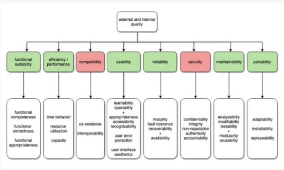

# Chapter 2: Testing Throughout the Software Development Lifecycle

Actual Notes: [Chapter 2](file:///C:/Users/User/Desktop/DegStud/Sem%207%202021/CSEB424%20Software%20Testing/chapter_2.pdf)

Terminology: [Glossary](https://glossary.istqb.org/en/search/)

-----
## Software Development Lifecycle Models
-----

### Characteristics of good testing

- For every development activity, there is a corresponding test activity
- Each test level has test objectives specific to that level
- Test analysis and design for a given test level begin during the corresponding development activity
  - Test analysis can start once SRS is ready
- Testers participate in discussions to define and refine requirements and design, and are involved in reviewing work products as soon as drafts are available
  - Why `to start early`, to avoid defects as early as possible

-----

### Common software development lifecycle models

- Sequential Developemnt Models
  - Software development process as a linear, sequential flow of activities
  - Deliver software that contains the complete set of features
  - Typically require months or years for delivery to stakeholders and users
- Iterative and Incremental Development Models
  - Incremental Dev.
    - Enstablishing requirements, designing, building, and testing a system in pieces
    - The software's features grow incrementally
    - The size of these feature increments varies, with some methods having larger pieces and some smaller pieces
  - Iterative Dev.
    - Groups of features are specified, designed, built, and tested together in a series of cycles
    - Each cycle has a fixed duration
    - May involve changes to features developed in
    - Earlier iterations, along with changes in project scope
    - Each iteration delivers working software which is a growing subset of the overall set of features until the final software is delivered or development is stopped

| Incremental | Iterative |
|:---:|:---:|
| Feature-oriented | Task-oriented |
| Rational Unified Process | Scrum |
| Spiral | Kanban |

-----

### Influencing factors in selecting and adopting SDLC
- the project goal
- the type of product being developed
- the business priority
- the identified product and project risks

-----

### Why software development models must be adopted?
- Difference in product risks of system
- Many business units can be part of a project or program
- Short time to deliver the product to the market

-----

### Integration of SDLC
- Vmodel amy be used for the developemtn and testing of the backend systems and their integrations
- Agile development model may be used to develop and test the front-end UI and functionality
- Prototyping may be used early in a project
- Incremental development model adopted once the experimental phase is completed

-----
## Test Levels
-----

- Groups of test activities that are organized and managed together
- Each test level is an ainstance of the test process
- Test levels are related to other activities within SDLC

-----

### Characterization of test levels

- Specific objectives
- Test basis, refereced to derive the test cases
- Test object
- Typical defects and failures
- Specific approaches and responsibility

-----

### Component Testing/ Unit Testing/ Module Testing

Focus: components that are separately testable

Objectives of component testing include:
  - Reducing risks
  - Verifying whether the functional and non-functional behaviors of the component are as designed and specified
  - Building confidence in the component's quality
  - Finding defects in the component
  - Preventing defects from escaping to higher test level

Coverage:
  - Functionality
  - Non-functional characteristic
  - Structural

Test Basis
  - Detailed Design
  - Code
  - Data Moel
  - Component specification

Test Object
  - Components, units or modules
  - Code and data structures
  - Classes
  - Database modules

Typical defects and failures
  - Incorrrect functionality
  - Data flow problems
  - Incorrect code and logics

Responsibility: Developer

Approaches: Automated components test cases and test-driven development (TDD)

-----

### Integration Testing

Focus: Interaction between components of the systems

Objectives:
- Reducing risks
- Verifying whether the functional and non-functional behaviors of the interfaces are as designed and specified
- Building confidence in the quality of the interfaces
- Finding defects (which may be in the interfaces themselves or within the components or system)
- Preventing defects from escaping to higher test levels

#### Levels of integration testing

Component Integration Testing
- Focuses on the interactions and interfaces between integrated components
- Performed after component testing
- Usually automated
- In iterative and incremental dev., component integration tests are usually part of the continuous integration process

System Integration Testing
- Focuses on the interactions and interfaces between systems, packages, and microservices
- Cover interactions with, and interfaces provided by, external organization
- Conducted after system testing....

Test Basis
  - Software and system design
  - Sequence diagram
  - Interface and communication protocol specification
  - Use cases
  - Architecture at component or system level
  - Workflow
  - External interface definition

Test Objects
  - Subsystems
  - Databases
  - Infrastructure
  - Interfaces
  - APIs
  - Microservices

Typical defects and failures
- Component Integration Testing
  - ...
- System Integration Testing
  - ...

Responsibility
  - Developers (Low-level testing)
  - Testers (High-level testing)

Approaches
  - System integration testing based on the system architecture
  - Integration should normally conduct in incremental way rather than as a whole
  - The greater the scope of integration, the more difficult it becomes to isolate the defects to a specific components of the system

-----

### System Testing

Focus: the behavior and capabilities of a whole system or product

Objectives:
  - Reduce risks
  - Verifying whether the functional and non-functional behaviors of the system are as designed and specified
  - Validating that the system is complete and will work as expected
  - Building confidence in the quality of the system as a whole
  - Finding defects
  - Preventing defects from escaping to higher test levels

Test Basis:
  - SRS
  - Risk analysis reports
  - Use cases
  - Epics and user stories
  - Models of system behaviors
  - State diagram
  - System and user manual

Test Objects:
  - Application
  - Hardware/software systems
  - OS
  - System under test (SUT)
  - System configuration and configuration data
  
Typical defects and failures:
  - Incorrect calculations
  - Incorrect or unexpected system functional or non-functional behavior
  - Incorrect control and/or data flows within the system
  - Failure to properly and completely carry out end-to-end functional tasks
  - Failure of the system to work properly in the system environments
  - Failure of the system to work as described in the system and user manual

Responsible
  - Independent testers

Approaches
  - Focus on the overall, end-to-end behavior of the system as a whole
  - covers both functional and non-functional
  - produces information for stakeholders to make release decisions
  - also to ensure the system satisfying legal or regulatory requirements or standards
  - The test environment should correspond to the final target in production environment

-----

### Acceptance Testing

Focus
  - similar to system testing

Objectives
  - Enstablishing confidence in the quality of the system as a whole
  - Validating that the system is complete and will work as expected
  - Verifying that functional and non-functional behaviors of the system are specified

Test basis
  - Business processes
  - User or business requirements
  - Regulations. legal contracts and standards
  - Use cases and/or user stories
  - System requirements
  - System or user documentation
  - Installation procedures
  - Risk analysis reports

Test objects
  - System under test
  - System configuration and configuration data
  - Business processes for a fully integrated system
  - Recovery systems and hot sites
  - Operational and maintenance processes
  - Forms
  - Reports
  - Existing and converted production data

Typical defects and failures
  - System workflows do not meet business or user requirements
  - Business rules are not implemented correctly
  - System does not satisfy contractual or regulatory requirements
  - Non-functional failures such asa security, vulnerabilities, inadequate performance efficiency under high loads, or improper operation on a supported platform

Responsibilities
  - customers
  - business users
  - product owners
  - operators of a system
  - other stakeholders
  
Approaches
  - May occur as the last test level or occu at other times
  - Iterative dev. Employ various form of acceptance testing during and at each end of iteration

Common forms of acceptabce testing
  - User acceptance testing
  - Operational acceptance testing
  - Contractual and regulatory acceptance testing
  - Alpha and beta testing

-----

#### User Acceptance Testing (UAT)

Focus: Validating the fitness for use of the system by intended users in a real or simulated operational environment

Main Objectives:
- building confidence that the users can:
  - use the system to meet their needs, fulfill requirements
  - Perform business processes with minimum difficulty, cost, and risk

-----

#### Operational Acceptance Testing (OAT)

Performed with operations or systems administration staff in a (simulated) production environment.

Focus on operational aspects:
- Testing of backup and restores
- Installing, uninstalling and upgrading
- Disaster recovery
- User management
- Maintenance tasks
- Data load and migration tasks
- Checks for security vulnerabilities
- Performance testing

Main Objectives: Building confidence that the operators or system administrators can keep the system working properly for the users in the operational environment, even under exceptional or difficult conditions

-----

#### Contractual and regulatory acceptance testing

Contractual Acceptance Testing:
  - Performed against a contract's acceptance criteria for producing custom-developed software
  - Acceptance criteria should be defined when the parties agree to the contract
  - performed bt users or by independent testers

Regulatory Acceptance Testing:
  - Performed against any regulations that must be adheard to, such as government, legal, or safety regulations
  - Performed by users or by independent testers, sometimes with the results being witnessed or audited by regulatory agencies.

Main Objective: Building confidence that contractual or regulatory compliance has been archived

-----

#### Alpha and beta testing

Main Objectives:
- Building confidence among potential or existing customers, and/or operators that they can use the system under normal, everyday conditions, and in the operational environment(s) to achieve their objectives with minimum difficulty, cost, and risk
- Detection of defects related to the conditions and environment(s) in which system will be used, especially when those conditions and environment(s) are difficult to replicate by the dev. team

Alpha testing
  - Performed at the developing organization's site
  - Performed by potential or existing customers, and/or operators or an independent test team

Beta testing
  - Performed by potential or existing customers, and/or operators at their own locations
  - May come after alpha testing or may occur without any proceding alpha testing have occured

-----

Low-Level Testing
- Unit/ Components/ Modules Testing
- Integration Testing

High-Level Testing
- System Testing
- Acceptance Testing

-----
## Test Types
-----

Definition: A group of test activities aimed at testing specific characteristics of a software system, or a part of a system, based on specific test objectives. 

Objectives: To evaluate...
- functional quality characteristics
- non-functional quality characteristics
- whether the structure or architecture of the component or system is correct, complete, and as specified
- the effects of changes, such as
  - confirmation testing
    - confirming that defects have been fixed
  - regression testing
    -  looking for unintended changes in behavior resulting from software or environment changes

-----
### Functional Testing
-----

- tests that evaluate functions that the system should perform.
- functional requirements may be described in work products such as business requirements specifications, epics, user stories, use cases, or functional specifications, or they may be undocumented
- performed at all test levels
- measured through functional coverage
- may involve special skills or knowledge of the particular business
problem the software solves

-----
### Non-functional Testing

- evaluates characteristics of systems and software such as usability, performance efficiency or security
- testing of “how well” the system behaves
- should be performed at all test levels, and done as early as possible
- measured through non-functional coverage
- may involve special skills or knowledge of the inherent weaknesses of a design or technology or the particular user base

*Both functional and non-functional testing are also known as BLACK-BOX TESTING*
-----

#### ISO/IEC 25010 (Replaced ISO 9126)

-----

### White-box Testing

- derives tests based on the system’s internal structure or implementation
- Internal structure may include code, architecture, work flows, and/or data flows within the system
- measured through structural coverage or code coverage
- may involve special skills or knowledge, such as the way the code is built, how data is stored and how to use coverage tools and to correctly interpret their results

-----

### Change-related Testing

Testing should be done after changes are made to system to ensure:
- the changes have corrected the defect
- implemented the functionality correctly
- The changes not caused any unforeseen adverse consequences

> Confirmation Testing
> - to confirm whether the original defect has been successfully fixed

> Regression Testing
> - running tests to detect such unintended side-effects.

- Important in iterative and incremental development lifecycles
- Regression testing is a strong candidate for automation

-----
### Test Types and Test Levels: Example of banking application

- Component Testing (`compound interest`)
  - Functional Tests
    - tests are designed based on how a component should calculate compound interest
  - Non-functional Tests
    - performance tests are designed to evaluate the number of CPU cycles required to perform a complex total interest calculation
  - White box Tests
    - tests are designed to achieve complete statement and decision coverage for all components that perform financial calculations
  - Change-related Tests
    - automated regression tests are built for each component and inculded within the continuous integration framework
- Component Integration Testing (`business logic`)
  - Functional Tests
    - tests are designed based on how account information captured at the user interface is passed to the business logic
  - Non-functional Tests
    - security tests are designed for buffer overflow vulnerabilities due to data passed from the user interface to the business logic
  - White box Tests
    - tests are designed to exercise how each screen in the browser interface passes data to the next screen and to the business logic
  - Change-related Tests
    - tests are designed to confirm fixes to interface-related defects as the fixes are checked into the code repository
- System Testing
  - Functional Tests
    - tests are designed based on how account holders can apply for a line of credit on their checking accounts
  - Non-functional Tests
    - portability tests are designed to check whether the presentation layer works on all supported browsers and mobile devices
  - White box Tests
    - tests are designed to cover sequences of web pages that can occur during a credit line application
  - Change-related Tests
    - all tests for a given workflow are re-executed if any screen on that workflow changes
- System Integration Testing
  - Functional Tests
    - tests are designed based on how the system uses an external microservice to check an account holder’s credit score
  - Non-functional Tests
    - reliability tests are designed to evaluate system robustness if the credit score microservice fails to respond
  - White box Tests
    - tests are designed to exercise all possible inquiry types sent to the credit score microservice
  - Change-related Tests
    - tests of the application interacting with the credit scoring microservice are re-executed daily as part of continuous deployment of that microservice
- Acceptance Testing
  - Functional Tests
    - Tests are designed based on how the banker handles approving or declining a credit application
  - Non-functional Tests
    - Usability tests are designed to evaluate the accessability of the banker's credit processing interface for people with disabilities
  - White box Tests
    - tests are designed to cover all supported financial data file structures and value ranges for bank-to-bank transfers
  - Change-related Tests
    - all previously-failed tests are re-executed after a defect found in acceptance testing is fixed

-----
## Maintenance Testing
-----

