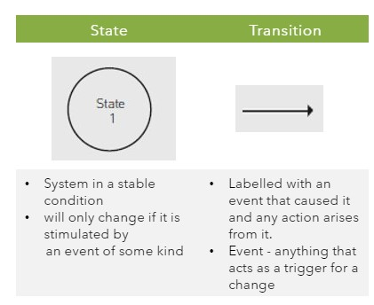
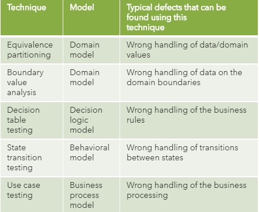

# Chapter 3: Testing Techniques

Actual Notes: [Chapter 3]()

Terminology: [Glossary](https://glossary.istqb.org/en/search/)

-----
## Categories of Test Techniques
-----

Test techniques 
- a procedure used to define test conditions, design test cases, and specify test data

-----
### Consideration Factors for Choosing Test Techniques
-----

- Component or system complexity
- Tester knowledge and skills
- Regulatory standards
- Available tools
- Customer or contractual requirements
- Time and budget
- Risk levels and types
- Software development lifecycle model
- Available documentation
- The types of defects expected in the component or system

-----
### Categories of Test Techniques and Their Characteristics
-----

- Black-box (aka specification-based testing)
  - also called behavioral or behavior-based techniques
  - based on an analysis of the appropriate test basis
  - applicable to both functional and non-functional testing
  - concentrate on the inputs and outputs of the test object without reference to its internal structure
- White-box (aka structural-based testing)
  - also called structural or structure-based techniques
  - based on an analysis of the architecture, detailed design, internal structure, or the code of the test object
  - concentrate on the structure and processing within the test object
- Experience-based
  - leverage the experience of developers, testers and users to design, implement, and execute tests
  - combined wiith bblack-box and white-box test techniques

-----
### Common characteristics of black-box techniques
-----

| Techniques | Reference to derive test condition, test cases and test data | Coverage Measurement |
|-----|-----|-----|
| Black-box test techniques | test basis such as SRS, use cases, and user stories | based on the items tested in the test basis and the technique applied to the test basis |
| White-box test techniques | test basis such as software architecture, detailed design, or any other soruce of information regarding the structure of the software | based on the items tested within a selected structure (e.g., the code or interfaces) and the technique applied to the test basis |
| Experience-based test techiques | knowledge and experience of testers, developers, users and stakeholders | *none* |

-----
## Black-Box Test Techniques
-----
### Equivalent Partitioning (EP)
-----
- Inputs to the software or system are divided into groups that are expected to exhibit similar behaviour, so they are likely to be processed in the same way
- Equivalent partitions (or classes):
  - Valid Data
  - Invalid Data
- Applied to human input, input via interfaces to a system, or interface parameters in integration testing

-----
### Boundary Value Analysis
-----
- Complement the equivalence partitioning​
- Can only be used when the partition is ordered, consisting of numeric or sequential data.​
- Boundary values : the minimum and maximum values (or first and last values) of a partition ​
- Test on the boundary values  for a given range of inputs:​
  -	min​
  - min - 1​
  - min + 1​
  -	max​
  - max - 1​
  -	max + 1​

-----
### Decision Table Testing
-----
- Used to test complex decision making ​
- Test  the combination of conditions

Business Rules = Condition(s) + Action(s)

Steps involve creating DT
1. Identify the conditions and its value
2. Identify the actions
3. Create the decision table
4. Determine the actions for the combination of conditions
5. Simplify the DT

-----
### State Transition Testing
-----

- A representation of the behavior of a system
- Consists of two symbols:
- Analyze the behavior in terms of what happens when a transition occurs

Symbols: 

-----
### Use Case Testing
-----

- Use case :  interactions between actors (users or systems), which produce a result of value to a system user or the customer. 
- Described at the abstract level (business use case, technology-free, business process level) or at the system level (system use case on the system functionality level).​
- Advantage of Use Case Tests :​
  - uncovering defects in the process flows during real-world use of the system​
  - useful for designing acceptance tests with customer/user participation​
  - uncover integration defects caused by the interaction and interference of different components
- Designing test cases from use cases may be combined with other specification-based test techniques. ​

-----
#### Use Case Scenario
-----

- A scenario is an instance of a use case​
- That is, it is a use case execution where in a specific user executes the use case in a specific way​

-----
#### Deriving test cases from use cases:​ A four step processes
-----

1. Identify the use case scenarios
   - Use simple matrix that can be implemented in a spreadsheet, database or test management tool.
   - Number the scenarios and define the combinations of basic and alternative flows that leads to them.​
   - Many scenarios are possible for one use case
   - Not all scenarios may be documented. Use an iterative process
   - Not all documented scenarios may be tested
     - ​Use cases may be at a level that is insufficient for testing
     - Team’s review process may discover additional scenarios 
2. For each scenario, identify one or more test cases
   - Parameters of any test case:
     - Conditions​
     - Input (data values)​
     - Expected result
     - Actual result
3. For each test case, identify the conditions that will cause it to execute:
   - For each test case identify the conditions that will cause it to execute a specific events.
   - Use matrix with columns for the conditions and for each condition state whether it is
     - Valid (V): must be true for the basic flow to execute​
     - Invalid (I): this will invoke an alternative flow
     - Not applicable (N/A): to the test case
4. Complete the test case by adding data values
   - Design real input data values that will make such conditions to be valid or invalid and hence the scenarios to happen.​
   - You may want to look at the use case constructs and branches.​

-----
### Summary of black box technique
-----
